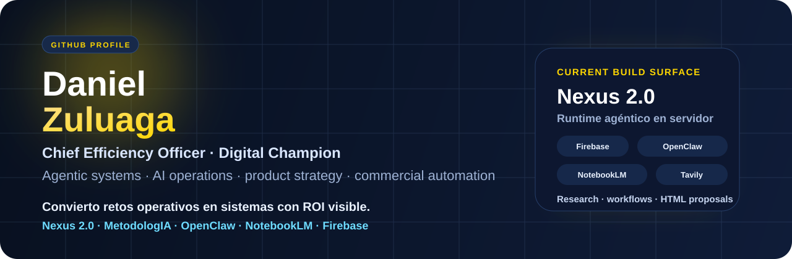

  

  

<h1 align="center">Daniel Zuluaga</h1>

<strong>Chief Efficiency Officer · Digital Champion · Agentic Systems Builder</strong>

  
  
  

  
  
  
  

## I build operating leverage

Convierto retos operativos en sistemas con ROI visible. Mi foco está en conectar **método, producto, automatización e IA** para que la estrategia deje de quedarse en ideas y termine convertida en ejecución real.

Hoy estoy trabajando especialmente en:

- **Sistemas agénticos en servidor** con memoria, research, workflows y entrega real.
- **Automatización comercial** que pasa de contexto a propuesta HTML descargable.
- **Arquitecturas privadas de IA** con OpenClaw, NotebookLM, GitHub y Firebase.
- **Eficiencia operativa** donde la IA amplifica al experto en vez de reemplazar el criterio.

## What is already live

| Sistema | Qué hace | Estado |
|---|---|---|
| **Nexus 2.0** | Runtime agéntico con Firebase, Cloud Run, Telegram, GitHub delivery, Tavily, NotebookLM y OpenClaw | Private / production |
| **Commercial Proposal Engine** | Investiga clientes, cruza servicios de MetodologIA y entrega propuestas HTML publicables | Private / production |
| **OpenClaw Private Gateway** | Gateway endurecido con Secret Manager, service account dedicada y sin IP pública | Private / production |
| **Prompt Factory Conversion** | Superficies canónicas para Forja y Prompt Analyst dentro de Nexus 2.0 | Active build |

## Flagship public repositories

| Repo | Propósito |
|---|---|
| [**MetodologIA**](https://github.com/danielfzuluagama-oss/MetodologIA) | Documentación, versionamiento y base metodológica del ecosistema. |
| [**KnoxMentor**](https://github.com/danielfzuluagama-oss/KnoxMentor) | Cerebro operativo para una experiencia asistida y orientada a ejecución. |
| [**propuestas-comerciales**](https://github.com/danielfzuluagama-oss/propuestas-comerciales) | Propuestas comerciales HTML listas para compartir y descargar. |
| [**Nexus-Backup**](https://github.com/danielfzuluagama-oss/Nexus-Backup) | Historial y respaldo de trabajo alrededor de la evolución del asistente. |
| [**RecursosAcaddemia**](https://github.com/danielfzuluagama-oss/RecursosAcaddemia) | Recursos y materiales estructurados para formación. |

## What I’m building right now

### Nexus 2.0

Un sistema operativo de asistencia con:

- conversación operativa por Telegram y API
- research web con cascada Tavily / Gemini
- NotebookLM remoto vía gateway
- proposals HTML publicadas en GitHub
- memoria persistente en Firestore
- OpenClaw privado como plano de acción

### MetodologIA in practice

Estoy bajando MetodologIA de discurso a runtime:

- catálogo real de servicios
- workflows reutilizables
- surfaces canónicas para capacidades heredadas
- calidad, seguridad y trazabilidad como parte del sistema

## Operating principles

- **ROI first**: si no mejora decisión, velocidad o claridad, sobra.
- **Operational sovereignty**: la tecnología debe dejar más control, no más dependencia.
- **Evidence before acceleration**: primero fundamento, luego velocidad.
- **AI as leverage**: las máquinas aportan escala; las personas ponen criterio.

## Current stack

**AI & orchestration**  
OpenClaw · NotebookLM · Tavily · multi-LLM routing · prompt systems · research pipelines

**Runtime & cloud**  
Firebase Functions · Cloud Run · Firestore · Secret Manager · GitHub delivery

**Ops & automation**  
n8n · Make · Telegram bots · HTML artifacts · workflow design · operational hardening

**Product & strategy**  
Product management · service packaging · process design · operating systems for execution

## Trajectory

- **MetodologIA** — Chief Efficiency Officer  
  Liderazgo de eficiencia, soberanía operativa y aplicación del framework **P.I.V.O.T.E.**

- **IAC (Ingeniería y Automatización)** — Formador técnico de IA  
  Formación práctica en IA generativa, n8n, Make y ChatGPT para optimización real de procesos.

- **Flypass** — Senior Product Manager  
  Reducción del **50% del time-to-market** para aliados y construcción de capacidades de pagos centralizados.

- **Sofka Technologies** — Product Expert & Team Facilitator  
  Aceleración de entrega, mejora de procesos TI y trabajo con patrones colaborativos de alto impacto.

- **Smart Innovation Touzi** — Product Expert  
  Implementaciones de alto impacto social y técnico con foco en backlog, producto y operación.

## Beyond the build

Me mueve la tecnología que sirve, los documentales, el cine de autor y las conversaciones donde una buena idea termina convertida en sistema. También lidero espacios de contenido y estrategia, y comparto el camino con **Canela**, mi partner más constante.

## Let’s build

Si quieres hablar de **agentes, eficiencia, producto, automatización o sistemas con IA que sí aterricen en operación**, escríbeme a [danielfzuluagama@gmail.com](mailto:danielfzuluagama@gmail.com).
